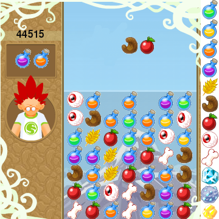
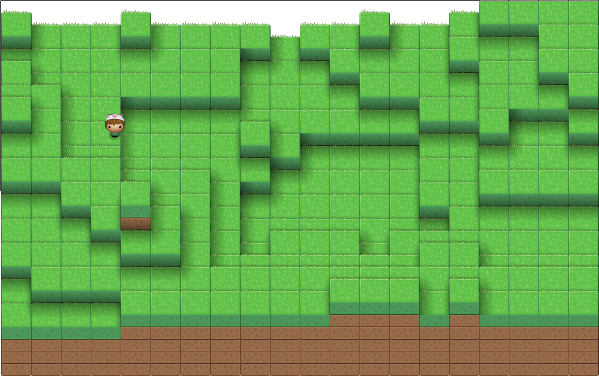
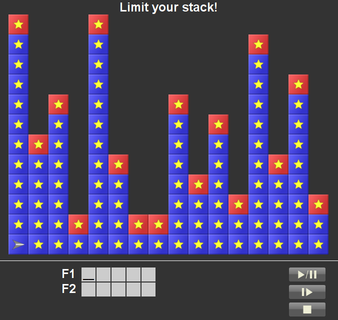
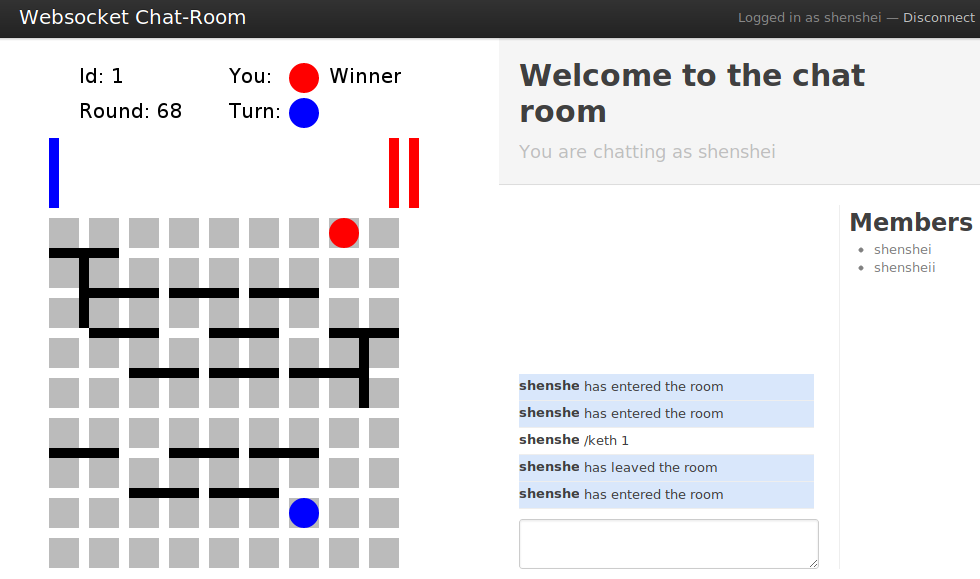

## Games 

### Naturalchimie [[.tar.gz]](files/projects/games/naturalchimie.tar.gz) 
Remake of the [naturalchimie](http://www.naturalchimie.com/) game in python/pygame.

### Donkey Konga [[.tar.gz]](files/projects/games/konga.tar.gz)
Remake of the DonkeyKonga (GameCube) game in python/pygame.

### Cute God game [site](files/projects/games/planetcute/planetcute.html)
Implementation javascipt/html5 of the [Cute God Challenge](http://www.lostgarden.com/search?q=planet+cute)

### Robozzle Solver [[.py]](files/projects/games/robozzle.py)
A solver for the puzzles from [Robozzle](http://robozzle.com/) in python.  

### Quoridor and Keth online game [[git]](https://github.com/shenshei/Quoridor)

Online implementation of two board games in HTML5/Canvas/SVG using the [Play2 Framework](http://www.playframework.org/)

## Programming challenges
### Project Euler [[python.tar.gz]](files/projects/challenges/euler-python.tar.gz) [[haskell.tar.gz]](files/projects/challenges/euler-haskell.tar.gz)
Resolution of some problems of the [Project Euler](http://projecteuler.net/) in
python and haskell.

### Google Code Jam  [[python.tar.gz]](files/projects/challenges/euler-python.tar.gz)
Resolution of some problems of the [Google Code Jam](http://code.google.com/codejam) in
python and haskell.

## Other Stuff
### Error Minning Implementation [[.tar.gz]](files/projects/error-minning.tar.gz)
Python implementation of the [algorithme](http://alpage.inria.fr/~sagot/pub/ACL06.pdf) of Benoit Sagot and Eric de la Clergerie. 

### IRC bot [[.tar.gz]](/files/projectspitch.tar.gz)
A modular IRC bot in python.
